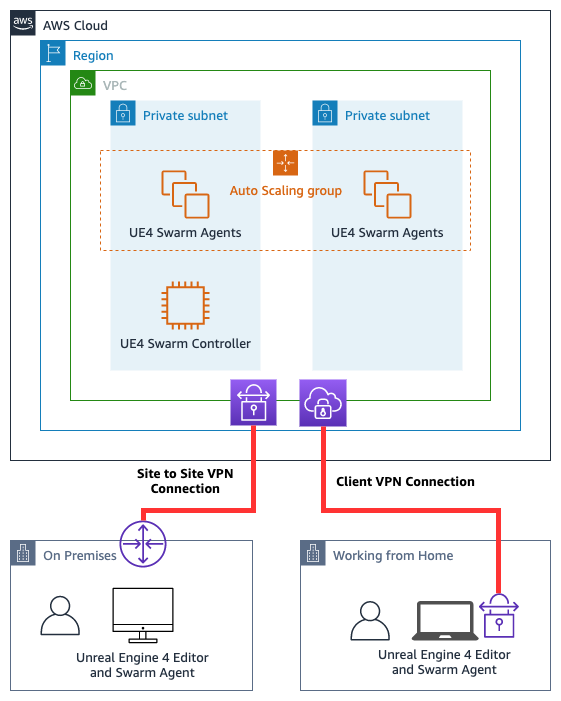

# Amazon EC2 cluster for Unreal Swarm

- [Description](#description)
- [Contents](#contents)
- [Architecture Diagram](#architecture-diagram)
- [Prerequirements](#prerequirements)
- [Deployment Steps](#deployment-steps)
  * [Initiate CDK](#initiate-cdk)
  * [Infra Deployment](#infra-deployment)
  * [Optional: Create EC2 Instance for Unreal Engine 4 -workstation](#Optional-Create-EC2-Instance-for-Unreal-Engine-4--workstation)
  * [Collecting dependencies](#Collecting-dependencies)
  * [Swarm Cluster Deployment](#swarm-cluster-deployment)
    * [Baking custom Windows AMI for UE4 Swarm](#Baking-custom-Windows-AMI-for-UE4-Swarm)
    * [Deploying UE4 Swarm Coordinator](#Deploying-UE4-Swarm-Coordinator)
    * [Deploying UE4 Swarm Agent Auto Scaling Group](#Deploying-UE4-Swarm-Agent-Auto-Scaling-Group)
- [Sending build task to UE4 Swarm on AWS](#Sending-build-task-to-UE4-Swarm-on-AWS)
- [Cleaning Up Resources](#cleaning-up-resources)
- [Extra Tips](#extra-tips)
- [License](#license)


# Description

This example allows you to run Unreal Swarm cluster on AWS. The CDK or Cloudformation templates create a new VPC for the Swarm EC2 instances to run in and it also uses EC2 Image Builder to automatically create a custom AMI as the base for your cluster. It also creates a S3 bucket where you will upload the Unreal Engine 4 dependencies packaged into a ZIP archive. This S3 bucket is also used as destination for EC2 Image Builder logs.

To be able to use the Swarm cluster you will need to be connected to the VPCs private subnets. You can achieve this by manually installing your own EC2 Instance where you install Unreal Engine. If you already have an existing workstation then you can connect to the cluster via Site to Site VPN or Client VPN. The Cluster needs to run inside private ip address range as you can't specify what IP addresess are used by the Swarm Agent process.

# Contents

This project repo contains:
* **PowerShell Scripts** that are used to collect dependencies from your local Unreal Engine 4 installation, customizing a Windows instance and launching the Swarm Agent with correct settings.
* **Infrastructure deployment automation** that deploys required infrastructure resources using AWS CDK or AWS CloudFormation.

# Architecture Diagram



# Prerequirements

To be able to build and use this example you will need a Unreal Engine 4 installation on Windows. This could be your existing setup or you can deploy a new Windows EC2 Instance into the VPC deployed in this example and install the Unreal Engine 4 onto that machine.

# Deployment Steps

On a high level the deployment is split into 3 parts. First step is to create a VPC and a S3 buckets. Second step is to connect your existing workstation to the VPC or creating a new virtual workstation into the VPC you created. During this step you will also run a Powershell script to create an archive of all the Swarm dependencies we need to create the cluster. Last step uses EC2 Image Builder to create a custom AMI from the depedencies archive you created and deployes a Swarm cluster for you.

## Initiate CDK

> This step is optional if you decide to use the CloudFormation tempaltes in the `cloudformation` -directory.

This project uses standard Python CDK project to deploy the Swarm cluster. If you don't have CDK installed then please follow these instructions at [AWS Cloud  Development Kit](https://docs.aws.amazon.com/cdk/latest/guide/getting_started.html#getting_started_install) -documentation.

When you have CDK and Python installed you can use folling steps to initiate this project:

Manually create a virtualenv on MacOS and Linux:

```
$ python3 -m venv .env
```

After the init process completes and the virtualenv is created, you can use the following
step to activate your virtualenv.

```
$ source .env/bin/activate
```

If you are a Windows platform you can manually create a virtualenv:

```
$ python -m venv .venv
```

Then you can activate the virtualenv like this:

```
% .env\Scripts\activate.bat
```

Also if you are on Windows platform please edit `cdk.json` -file to point to your Python runtime.

Once the virtualenv is activated, you can install the required dependencies.

```
$ pip install -r requirements.txt
```
## Infra Deployment

The example needs a VPC with two Public subnets and two Private subnets plus Nat Gateway. We also need a S3 bucket for the dependency archive and EC2 Image Builder logs.

You can deploy these with CDK or by using CloudFormation template. By default we will create the VPC with CIDR `10.0.0.0/16` and allow traffic to the Swarm Cluster from CIDR Prefix `10.0.0.0/8`. These values can be changed by editing the `cdk.json`-file and giving new values for `vpc_cidr` and `trusted_cidr`.

To deploy the Infrastructure you can run following command:
```
$ cdk deploy swarm-infra
```

Alternatively you can use the `cloudformation/swarm-infra.yaml` -template to create a CloudFormation stack called `swarm-infra` using the AWS Console and AWS CLI. If you want to customize the VPC CIDR you will need to edit the CloudFormation template or use the CDK to synthesize new one with the CDK context variable (see the [Tips](#extra-tips) section).

CLI example:
````
$ aws cloudformation create-stack --stack-name swarm-infra --template-body file://cloudformation/swarm-infra.yaml
````

Once the creation of resources is ready you can move to next step.

## Connecting your Unreal Engine 4 -workstation to the new VPC

To be able to use the Swarm Agent cluster, you will need to have an existing Unreal Engine 4 -workstation that is able to connect to this VPC. Or you can follow the optional step below to create a new EC2 Instance to host your Unreal Engine 4 -workstation.
This workstation needs to be able to communicate to all the private IP addresses of the Swarm cluster nodes on TCP port 8008 and 8009. The workstation also need to be able to send ICMP Ping (Request and response) to the Swarm cluster nodes.

You can use following commands on Windows Workstation Powershell to open the necessary ports:
````
New-NetFirewallRule -DisplayName 'Allow UE4 Swarm TCP' -Direction Inbound -Action Allow -Protocol TCP -LocalPort 8008-8009 -RemoteAddress <IP prefix of the VPC>
New-NetFirewallRule -DisplayName 'Allow UE4 Swarm UDP' -Direction Inbound -Action Allow -Protocol UDP -LocalPort 8008-8009 -RemoteAddress <IP prefix of the VPC>
New-NetFirewallRule -DisplayName 'Allow ICMP' -Direction Inbound -Action Allow -Protocol ICMPv4 -RemoteAddress <IP prefix of the VPC>
````

Methods of connection existing workstation to this UE4 Swarm cluster:
* If you just need to connect one work station you can use [AWS Client VPN](https://docs.aws.amazon.com/vpn/latest/clientvpn-admin/what-is.html) -service
* If you are going to share the cluster with other or work from an office you should use [AWS Site-to-Site VPN](https://docs.aws.amazon.com/vpn/latest/s2svpn/VPC_VPN.html) -service
* If you already have existing AWS infrastructure you can also consider using Amazon Virtual Private Cloud's [VPC Peering](https://docs.aws.amazon.com/vpc/latest/peering/what-is-vpc-peering.html) -feature or [AWS Transit Gateway](https://docs.aws.amazon.com/vpc/latest/tgw/what-is-transit-gateway.html) -service to allow you to communicate from your workstation to the Swarm Cluster.


## Optional: Create EC2 Instance for Unreal Engine 4 -workstation

If you don't already have an Unreal Engine 4 workstation that you can connect to the VPC via VPN (Site to Site or Client VPN) then you can now launch a new Windows EC2 Instance into the VPC's Public subnets. You can for example launch [NVIDIA's AMI](https://aws.amazon.com/marketplace/search/results/?page=1&filters=instance_types&instance_types=g4dn.xlarge&searchTerms=NVIDIA%20Gaming) with all the drivers or follow for this [guide from Parsec](https://blog.parsec.app/rtx-cloud-gaming-with-the-new-aws-g4-instances-11d1c60c2d09/) on how to create a G4dn based graphical workstation on AWS.

## Collecting dependencies 

Each Windows instance that will act as a Swarm Coordinator or as a Swarm Agent will need a set of prerequisites installed.
We can collect these prerequisites from your existing Unreal Engine 4 installation with the provided `assets/create-depdendency-archive.ps1` -script in this repo.
* This PowerShell script will copy all the components that are needed to customize a fresh Window installation
* The script assumes that your Unreal Engine is installed to `C:\Program Files\Epic Games\UE_4.25`-directory but you can customize the script to match your location
* Script will create a compressed archive called `ue4-swarm-archive.zip` under your `My Documents` -directory
* You can find more details about these prerequisites at:
  * [Unreal Engines 4's Hardware and Software requirements](https://docs.unrealengine.com/en-US/GettingStarted/RecommendedSpecifications/index.html) -page 
  * [Setting up Swarm Coordinator and Swarm Agents instructions](https://docs.unrealengine.com/en-US/Engine/Rendering/LightingAndShadows/Lightmass/UnrealSwarmOverview/index.html) -page 

After you have created the `ue4-swarm-archive.zip` -archive you need to upload it into the root -directory of the newly created S3 bucket. It will be downloaded from that location and used during the EC2 Image Builder -process. The name of the bucket is available as an output called `BucketName` from the `swarm-infra` -stack.

With AWS CLI you can use following command:
```
$ aws s3 cp ue4-swarm-archive.zip s3://<NAME OF THE S3 BUCKET>/
```

## Swarm Cluster Deployment

To deploy the Swarm Cluster you can run following command:
```
$ cdk deploy swarm-deployment
```

Alternatively you can use the `cloudformation/swarm-deployment.yaml` -template to create a CloudFormation stack called `swarm-deployment` using the AWS Console and AWS CLI.

CLI example:
````
$ aws cloudformation create-stack --stack-name swarm-deployment --capabilities CAPABILITY_NAMED_IAM --template-body file://cloudformation/swarm-deployment.yaml
````

This step will take **30 minutes** on average as it's baking the Window AMI for Swarm. The steps to install all dependencies does take some time to complete. While the deployment is running you can read below for details on what's happening during stack creation.

### Baking custom Windows AMI for UE4 Swarm
The `swarm-deployment` -stack will first configure EC2 Image Builder to use latest "Microsoft Windows Server 2019 Base" image as the base image. It also creates a EC2 Image Builder component defining the build steps. These steps will download the Zip -arcive from S3, install .Net runtime, run the `UE4PrereqSetup_x64.exe` -intaller and then open Windows Firewall for the Swarm ports. You can view the `assets/component.yaml` -file for details.

Once the EC2 Image Builder completes it will create a private AMI under your account. This AMI contains all the required Unreal Engine 4 Swarm build dependencies and can be used to quickly launch the Swarm Coordinator and Swarm Agents.

### Deploying UE4 Swarm Coordinator
The Swarm Coordinator will be launched as a single EC2 Instance. The launch will use `User Data` to configure the Windows to start SwarmCoordinator.exe on bootup. You can view the contents of the `User Data` in `assets/start-coordinator.ps1` - Powershell script.

### Deploying UE4 Swarm Agent Auto Scaling Group
The Swarm Agents are going to be launched as Auto Scaling Group. Enabling us to quickly scale the number of nodes up and down. As the Swarm Agents need to be already online and registered when you submit a UE4 build, we can't use any metrics to scale the cluster on demand.
Instead you can use for example Schedule or some script to scale the cluster before submit a job. With a schedule you could for example configure the cluster to scale up to certain number of nodes in the morning and then after office hours scale the cluster back to zero.

The Swarm Agent will also use `User Data` to configure the Windows to start SwarmAgent.exe on bootup and injects a Swarm configuration file into the Instance. This configuration file will set number of threads to equal amount of CPU Core and also will set the Coordinator IP address. You can view the contents of the `User Data` in `assets/start-agent.ps1` - Powershell script.

# Sending build task to UE4 Swarm on AWS

Now that the Swarm Cluster CloudFormation stack has completed deployment you should see two EC2 Instances running on your new VPC. Also the CDK/CloudFormation stack should have outputed the private IP address of the Swarm Coordinator that you can now use.

On your Unreal Engine 4 -workstation you have to configure the local Swarm Agent. You can launch it from `C:\Program Files\Epic Games\UE_4.25\Engine\Binaries\DotNET` -directory. After this you will need fo configure following settings:
* `AgentGroupName`: `ue4-swarm-aws`
* `AllowedRemoteAgentGroup`: `ue4-swarm-aws`
* `AllowedRemoteAgentNames`: `*`
* `CoordinatorREmoteHost`: `<Add Coordinator private IP>`

# Cleaning Up Resources

To clean up this example you need to delete the two CloudFormation stacks. Start by deleting the `swarm-deployment` -stack and once it's completely removed you can delete the `swarm-infra` -stack.

With CDK you can delete the stacks with:
Example commands:
````
 $  cdk destroy "*"
````

After this you will have two resources that you need to delete manually. First the S3 bucket will need to be deleted manually and second the AMI that was created needs to be deleted.

Example commands:
````
 $  aws s3 rb s3://<bucket-name> --force
 $ 
 $  aws ec2 deregister-image --image-id <AMI ID>
````

# Extra Tips
## How to view Swarm agent logs

You can use the Session Manager to open Powershell session to the Coordinator or Swarm instances. Only Swarm Agent writes logs (Coordinator doesn't have any logs) that are located under: `C:\ue4-swarm\SwarmCache\Logs`

## How to access Swarm Instances Remote Desktop

As we are not defining the Administrator password nor defining an SSH key for the EC2 instances we have to reset the password manually. The instances do have System Manager enabled so we can use Session Manager to launch a Powershell inside the Instance and use following snippet to reset the password:

```
$Password = Read-Host -AsSecureString
Get-LocalUser -Name "Administrator" | Set-LocalUser -Password $Password
```
## Updating CloudFormation templates after code changes

If you do changes to the CDK code and want to generate new CloudFormation templates you will need to use following commands to keep the stack references in sync:

```
cdk synth swarm-infra -e > cloudformation/swarm-infra.yaml
cdk synth swarm-deployment -e > cloudformation/swarm-deployment.yaml
```

# Security

See [CONTRIBUTING](CONTRIBUTING.md#security-issue-notifications) for more information.

# License

This library is licensed under the MIT-0 License. See the LICENSE file.